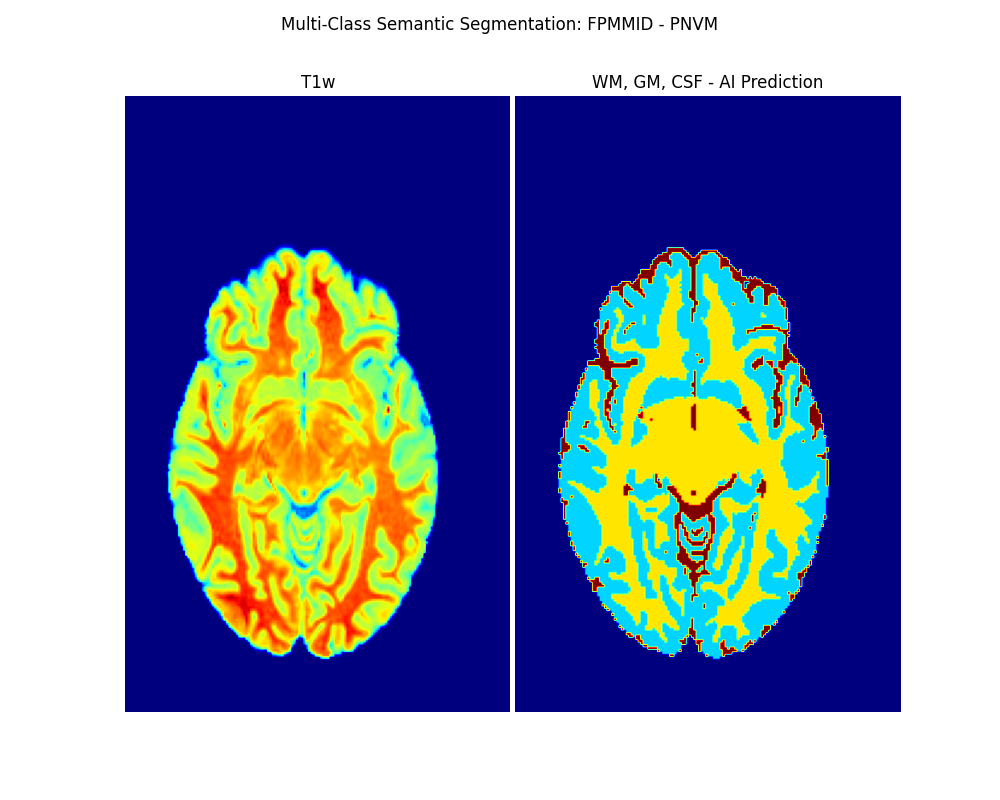

# Federated Prediction Models for Medical Imaging Data (FPMMID)

## Description
FPMMID will provide federated Machine-Learning and Deep-Learning
 based Prediction Models for a myriad collection of Medical 
Imaging data from various Data Acquisition systems across 
the hospital. Currently, FPMMID provides fast-response predictive
 4-layer 3D segmentation of individual TW1 MR imaging scans. 
FPMMID is currently being tested with the PING (Pediatric Imaging, 
Neurocognition, and Genetics Data Repository) dataset 
(paper link: https://www.ncbi.nlm.nih.gov/pmc/articles/PMC4628902/pdf/nihms691152.pdf  

## Table of Contents
- [Requirements](#requirements)
- [Installation](#installation)
- [Usage](#usage)
- [Test](#test)
- [License](#license)
- [Contact](#contact)

## Requirements
* This software has been successfully compiled 
and tested on CentOS 7 and MacOS v11.6.
However, the Build section will attempt to create the dependency stack 
similarly based on any Linux-based OS.

* CentOS 7: `make 3.8+` must be installed as follows:

```
sudo yum -y install make
```

* MacOS: `make 3.8+` and `pkg-config` must be installed as follows:

```
sudo brew install make pkg-config
```

Note all preset variables can be found in `src/input.sh`

## Installation
To install fpmmid

```
make install
``` 

Note, this may take several minutes. You may start a screen session or
run the build step interactively on the commandline. 

## Usage
To predict WM, GM and CSF on a given MR scan with nii.gz format:

### locally

```
source src/fpmmid.sh
fpmmid -i <input_path> -o <output_dir>
```
### on a slurm cluster with GPU support:

```
source src/fpmmid.sh
fpmmid -i <input_path> -o <output_dir> -p slurm
```

Note, you can view the log at `pred.log` on the current folder.

### Outputs
Two output files will be generated in `output` directory:
* Predicted Segmentated Volume in nii.gz format
* 2D segmentation of the middle z slice along with its associated MR scan

## Test

```
source src/fpmmid.sh
fpmmid -i input/P0997_t1w.nii.gz -o output
```

### Runtime
Here are the execution times for a sample MR scan on different platforms:
* BCH MGHPCC 		- CentOS 7  	- GPU Quadro RTX 8000 	- 48GB RAM - 2 CPU cores: 18 seconds
* BCH MGHPCC 		- CentOS 7  	- CPU only 				- 48GB RAM - 2 CPU cores: 37 seconds
* MacBook Pro 2017  - MacOS 11.6 	- CPU only 				- 8GB RAM  - 1 CPU core:  58 seconds

## License
Copyright (c) 2022  Boston Children's Hospital: \
					Arash Nemati Hayati \
					Can Taylan Sari \
					Simon K Warfield

## Contact
If you If you have any questions or would like to collaborate on this project
please contact [research.computing@childrens.harvard.edu](mailto:research.computing@childrens.harvard.edu)
